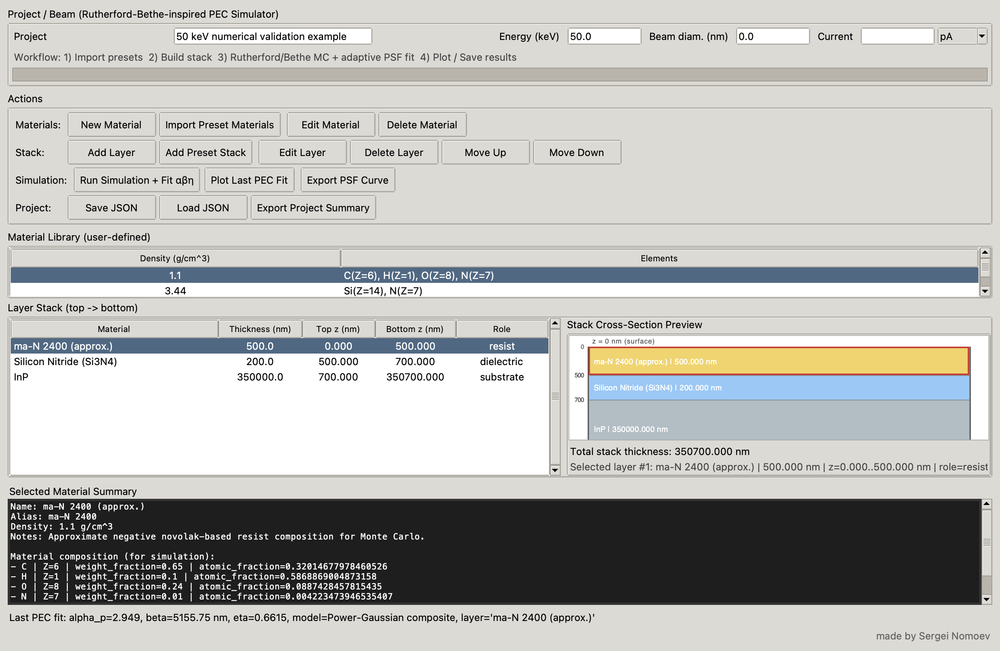
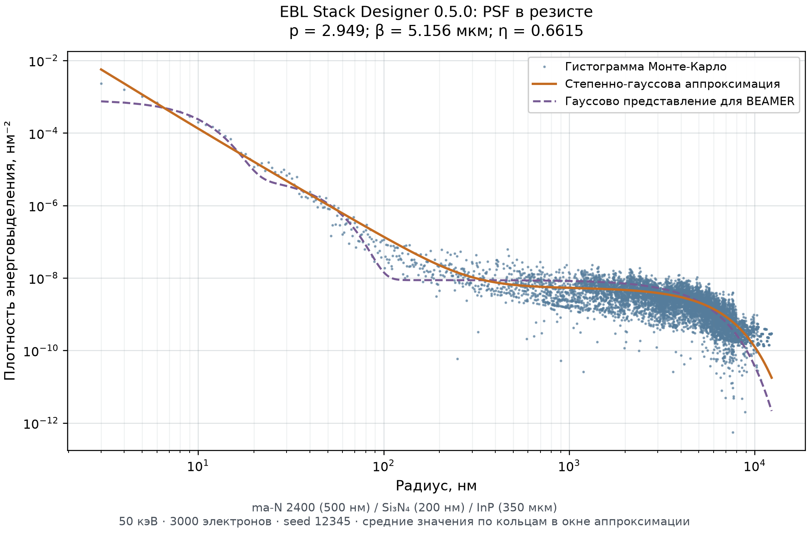

# EBL Stack Designer

EBL Stack Designer is a desktop Python/Tkinter application for electron-beam lithography stack design, approximate Monte Carlo-style electron transport, radial PSF extraction, and proximity effect correction parameter generation intended for BEAMER workflows.

Author: `Sergei Nomoev`

Suggested GitHub repository description:

`Python GUI for EBL multilayer stack design, approximate Monte Carlo PSF simulation, and BEAMER-style PEC exports.`

## What It Is

`EBL Stack Designer` is a practical engineering GUI for building multilayer EBL stacks and estimating proximity-effect parameters without requiring a full external Monte Carlo workflow for every iteration.

The program was developed to combine common day-to-day EBL PEC tasks into one lightweight workflow: stack definition, material bookkeeping, approximate electron transport, PSF fitting, BEAMER-style Gaussian parameters, and numerical PSF export.

It is meant for:

- rapid PEC exploration
- comparing substrates, resists, and layer stacks
- estimating `alpha`, `beta`, `eta`, or `alpha_p`
- generating BEAMER Gaussian Approximation starting values
- exporting numerical PSF curves for BEAMER-style workflows
- educational and engineering use

It is not meant to replace calibrated production workflows, CASINO, mcTrace, Geant4, PENELOPE, or experimental process calibration.

## Why This Exists

In practical EBL work, PEC values are often obtained by combining commercial Monte Carlo tools, custom scripts, and manual transfer of PSF parameters into layout software. This project aims to make that workflow faster and more transparent for stack-level exploration.

The code keeps the model lightweight enough for interactive use while exposing diagnostics such as PSF normalization, fit residuals, fit window, export metadata, and warnings.

## Screenshots

Main stack-design and simulation interface:



PEC fit plot with simulated deposited-energy histogram, selected PSF fit, and BEAMER Gaussian approximation:



## Correctness update in 0.5.0

Version 0.5.0 corrects interface transport, material composition,
radial binning, annular-average fitting, global PSF normalization and result
provenance. It records the primary-electron energy balance and limit truncation.
Material mass fractions are the canonical composition input; layer thicknesses
remain finite exactly as entered. See [the correctness review](docs/CORRECTNESS_REVIEW.md)
for the reproduced failures and remaining physical-validation work.

The screenshots above show version 0.5.0 and the saved 50 keV ma-N 2400 / Si₃N₄ / InP example.
The [numerical check report](docs/validation/example-50keV.json) records its energy balance and internally validated exports.
Export files pass internal roundtrip checks; import into BEAMER has not yet been independently verified.
Rerun projects calculated with earlier versions before using their parameters or exporting a numerical PSF.
Legacy plots remain identifiable, but stored window-normalized eta values are not
silently converted to the new global convention.

The 0.65/0.35 stopping blend is retained as an uncalibrated legacy approximation.
Passing the numerical regression suite is not a claim of measured PEC accuracy.

## Current Highlights

- custom material library with elemental composition, density, weight fraction, and atomic fraction
- multilayer stack editor with roles such as `resist`, `substrate`, `metal`, `dielectric`, and `adhesion`
- preset example stack for PMMA bilayer / graphene / Al2O3 / Au / SiO2 / thin Si
- combined PEC analysis for multiple layers marked as `resist`
- stack cross-section preview
- resizable dialogs and scrollable forms/lists
- standalone transport simulation for the selected resist layer
- adaptive PSF fitting:
  - double-Gaussian
  - power-Gaussian composite
- weighted fitting with center-priority
- automatic noisy-tail cutoff during fit preparation
- BEAMER Gaussian Approximation output in micrometers, including `Alpha`, `Beta`, `Eta`, `Gamma1`, and `Nue1`
- editable BEAMER short-range blur FWHM value in the simulation dialog
- estimated micrometer parameters for BEAMER workflows shown directly on the PEC fit plot
- optional BEAMER Gaussian approximation curve shown on the same PEC plot as the selected PSF fit
- PSF curve export as BEAMER-style compressed `.lpsf`, simple two-column `.psf`, or full diagnostic `.csv`
- PSF normalization diagnostics, fit residual metrics, export metadata, and export roundtrip validation
- legacy JSON migration with `schema_version`
- no-GUI smoke test for fitting and export validation
- fit plot viewer
- live Monte Carlo progress window with:
  - electron count
  - percent complete
  - elapsed time
  - ETA
  - approximate electron rate
- JSON save/load
- exportable project summary

## Physics Summary

The program contains a lightweight standalone physical approximation for EBL transport and PEC fitting.

Implemented ideas include:

- compound material properties derived from elemental fractions
- effective atomic number and atomic weight
- Bragg-type compound stopping bookkeeping
- Joy-Luo / modified Bethe inspired continuous slowing-down
- screened Rutherford-inspired elastic scattering
- Kanaya-Okayama / Kyser-Murata style `E^1.67` range scaling
- radial deposited-energy histogram inside the selected resist layer
- adaptive PSF model selection based on fit quality and exposure regime

Short version:

- transport is approximate but physically motivated
- fitting is intended to give useful engineering PEC parameters
- the code is fast enough for interactive iteration inside a GUI

More detail is in [docs/PHYSICS.md](docs/PHYSICS.md).

## References Behind The Current Direction

- Qingyuan Mao, Jingyuan Zhu, Xinbin Cheng, Zhanshan Wang, "Proximity effect correction in electron beam lithography using a composite function model of electron scattering energy distribution", Discover Nano (2025). DOI: [10.1186/s11671-025-04264-0](https://doi.org/10.1186/s11671-025-04264-0)
- "Fast and accurate proximity effect correction algorithm based on pattern edge shape adjustment for electron beam lithography", Microelectronics Journal (2023). DOI: [10.1016/j.mejo.2023.105718](https://doi.org/10.1016/j.mejo.2023.105718)
- Takashi Kamikubo et al., JJAP (1997). DOI: [10.1143/JJAP.36.7546](https://doi.org/10.1143/JJAP.36.7546)
- Joy and Luo, Scanning (1989)
- Kyser and Murata, IBM Journal of Research and Development (1974)
- Chang, Journal of Vacuum Science and Technology (1975)

## Repository Layout

- `ebl_stack_designer.py` — main application
- `run_ebl_stack_designer.sh` — shell launcher
- `run_ebl_stack_designer.command` — macOS double-click launcher
- `requirements.txt` — runtime Python dependencies
- `docs/PHYSICS.md` — short physics note

## Installation

### Create a virtual environment

```bash
python3 -m venv .venv
source .venv/bin/activate
```

### Install dependencies

```bash
pip install -r requirements.txt
```

Dependencies:

- `numpy`
- `matplotlib`
- `tkinter` from the Python installation

On Linux, `tkinter` may need a system package such as `python3-tk`.

## Run

### Standard shell launcher

```bash
./run_ebl_stack_designer.sh
```

### macOS double-click launcher

```bash
run_ebl_stack_designer.command
```

### Direct Python launch

```bash
python3 ebl_stack_designer.py
```

### Important macOS note

On some macOS systems, `/usr/bin/python3` is not suitable for this GUI app.

If needed, use the python.org Framework build explicitly:

```bash
/Library/Frameworks/Python.framework/Versions/3.12/bin/python3 ebl_stack_designer.py
```

If dependencies are missing for that interpreter:

```bash
/Library/Frameworks/Python.framework/Versions/3.12/bin/python3 -m pip install numpy matplotlib
```

The bundled launchers try to prefer a Python interpreter with working `tkinter`.

## Smoke Test

Run the headless correctness regressions and complete workflow test, followed by the engineering export smoke test:

```bash
python3 -m unittest discover -s tests -p "test_*.py" -v
python3 tests/smoke_test.py
```

Reproduce the 50 keV example (3000 electrons, seed 12345) with:

```bash
python3 tools/check_example.py --output example-check.json --project-output example-project.json --plot-output example-psf.png
```

This checks execution, energy accounting and internal export consistency; it is not an independent physical validation.

## Basic Workflow

1. Add or import materials.
2. Build the stack from top to bottom.
3. Mark the resist layer with role `resist`.
4. Set beam energy and optional beam diameter/current.
5. Run `Simulation + Fit`.
6. Watch the dedicated progress window during Monte Carlo.
7. Inspect the fit result and plot.
8. Save the project or export a summary.

For the included Sergei example stack, use `Add Preset Stack` and choose:

`PMMA bilayer / graphene / Al2O3 / Au / SiO2 / thin Si (Sergei example)`

The preset represents:

- PMMA 950k, 90 nm
- PMMA 495k, 150 nm
- graphene / carbon, 1 nm
- ALD-like Al2O3, 100 nm
- Au, 70 nm
- SiO2, 300 nm
- Si, 4.4 um

Both PMMA layers are marked as `resist`; during simulation the app can fit them as one combined resist region.

## What The Fit Produces

Depending on the chosen model, the program can estimate:

- `alpha` for double-Gaussian forward blur
- `alpha_p` for power-Gaussian forward behavior
- `beta` for long-range backscatter spread
- `eta` fit ratio
- split-based forward/back energy ratio estimate
- simple PEC guidance text based on long-range blur strength

The fit pipeline currently includes:

- weighted log-space fitting
- center-priority weighting
- signal-based downweighting
- optional far-tail automatic cutoff when the histogram becomes noise-dominated

## Current Limitations

- this is still a fast approximate standalone model
- it is not numerically identical to CASINO
- commercial resist presets are approximate because exact chemistries are proprietary
- PEC parameters should still be calibrated against experiment for real process use
- a two-component PSF can still be too simple for some exposure regimes

## Good Use Cases

- fast substrate comparison
- resist / thickness trend exploration
- early PEC parameter estimation
- generating starting values for more detailed calibration
- teaching / demonstration of EBL scattering and PEC behavior
